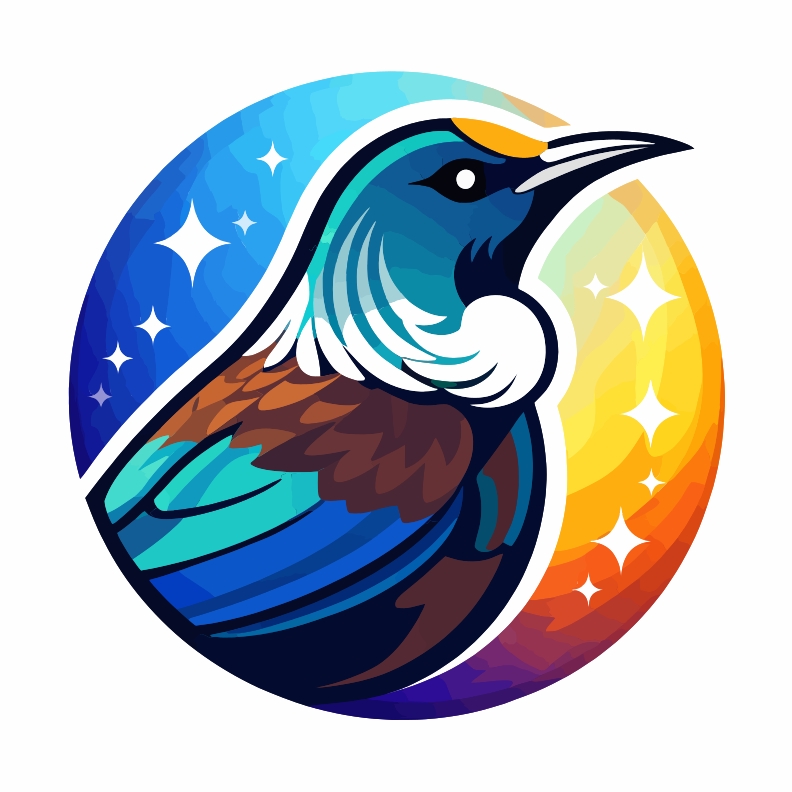

<p align="center">
  
</p>

# xocdr/tui

A Terminal UI framework for PHP. Build beautiful, interactive terminal applications with a component-based architecture and hooks for state management.

## Features

- 🎨 **Component-based** - Build UIs with composable components (Box, Text, etc.)
- ⚡ **Hooks** - state, onRender, memo, onInput, and more
- 📦 **Flexbox layout** - Powered by Yoga layout engine via ext-tui
- 🎯 **Focus management** - Tab navigation and focus tracking
- 🔌 **Event system** - Priority-based event dispatching with propagation control
- 🧪 **Testable** - Interface-based design with mock implementations

## Requirements

- PHP 8.4+
- ext-tui (C extension)

## Installation

```bash
composer require xocdr/tui
```

## Quick Start

```php
<?php

use Xocdr\Tui\Tui;
use Xocdr\Tui\Components\Box;
use Xocdr\Tui\Components\Text;
use Xocdr\Tui\Hooks\Hooks;

$app = function () {
    $hooks = new Hooks(Tui::getApplication());

    [$count, $setCount] = $hooks->state(0);
    ['exit' => $exit] = $hooks->app();

    $hooks->onInput(function ($key) use ($setCount, $exit) {
        if ($key === 'q') {
            $exit();
        }
        if ($key === ' ') {
            $setCount(fn($c) => $c + 1);
        }
    });

    return Box::create()
        ->flexDirection('column')
        ->padding(1)
        ->border('round')
        ->children([
            Text::create("Count: {$count}")->bold(),
            Text::create('Press SPACE to increment, Q to quit')->dim(),
        ]);
};

Tui::render($app)->waitUntilExit();
```

## Components

### Box

Flexbox container for layout:

```php
use Xocdr\Tui\Components\Box;

Box::create()
    ->flexDirection('column')  // 'row' | 'column'
    ->alignItems('center')     // 'flex-start' | 'center' | 'flex-end'
    ->justifyContent('center') // 'flex-start' | 'center' | 'flex-end' | 'space-between'
    ->padding(1)
    ->paddingX(2)
    ->margin(1)
    ->gap(1)
    ->width(50)
    ->height(10)
    ->aspectRatio(16/9)        // Width/height ratio
    ->direction('ltr')         // 'ltr' | 'rtl' layout direction
    ->border('single')         // 'single' | 'double' | 'round' | 'bold'
    ->borderColor('blue')
    ->children([...]);

// Shortcuts
Box::column([...]); // flexDirection('column')
Box::row([...]);    // flexDirection('row')
```

### Text

Styled text content:

```php
use Xocdr\Tui\Components\Text;

Text::create('Hello World')
    ->bold()
    ->italic()
    ->underline()
    ->strikethrough()
    ->dim()
    ->inverse()
    ->color('#ff0000')     // Hex color
    ->bgColor('#0000ff')   // Background color
    ->wrap('word');        // 'word' | 'none'

// Color shortcuts
Text::create('Error')->red();
Text::create('Success')->green();
Text::create('Info')->blue()->bold();
```

### Other Components

```php
use Xocdr\Tui\Components\Fragment;
use Xocdr\Tui\Components\Spacer;
use Xocdr\Tui\Components\Newline;
use Xocdr\Tui\Components\Static_;

// Fragment - group without extra node
Fragment::create([
    Text::create('Line 1'),
    Text::create('Line 2'),
]);

// Spacer - fills available space (flexGrow: 1)
Box::row([
    Text::create('Left'),
    Spacer::create(),
    Text::create('Right'),
]);

// Newline - line breaks
Newline::create(2); // Two line breaks

// Static - non-rerendering content (logs, history)
Static_::create($logItems);
```

## Hooks

The `Hooks` class provides state management and side effects for components.

```php
use Xocdr\Tui\Hooks\Hooks;

$hooks = new Hooks($instance);
```

### state

Manage component state:

```php
[$count, $setCount] = $hooks->state(0);

// Direct value
$setCount(5);

// Functional update
$setCount(fn($prev) => $prev + 1);
```

### onRender

Run side effects:

```php
$hooks->onRender(function () {
    // Effect runs when deps change
    $timer = startTimer();

    // Return cleanup function
    return fn() => $timer->stop();
}, [$dependency]);
```

### memo / callback

Memoize values and callbacks:

```php
$expensive = $hooks->memo(fn() => computeExpensiveValue($data), [$data]);
$handler = $hooks->callback(fn($e) => handleEvent($e), [$dependency]);
```

### ref

Create mutable references:

```php
$ref = $hooks->ref(null);
$ref->current = 'new value'; // Doesn't trigger re-render
```

### reducer

Complex state with reducer pattern:

```php
$reducer = fn($state, $action) => match($action['type']) {
    'increment' => $state + 1,
    'decrement' => $state - 1,
    default => $state,
};

[$count, $dispatch] = $hooks->reducer($reducer, 0);
$dispatch(['type' => 'increment']);
```

### onInput

Handle keyboard input:

```php
$hooks->onInput(function ($key, $nativeKey) {
    if ($key === 'q') {
        // Handle quit
    }
    if ($nativeKey->upArrow) {
        // Handle arrow key
    }
    if ($nativeKey->ctrl && $key === 'c') {
        // Handle Ctrl+C
    }
}, ['isActive' => true]);
```

### app

Access application controls:

```php
['exit' => $exit] = $hooks->app();
$exit(0); // Exit with code 0
```

### focus / focusManager

Manage focus:

```php
// Check focus state
['isFocused' => $isFocused, 'focus' => $focus] = $hooks->focus([
    'autoFocus' => true,
]);

// Navigate focus
['focusNext' => $next, 'focusPrevious' => $prev] = $hooks->focusManager();
```

### stdout

Get terminal info:

```php
['columns' => $cols, 'rows' => $rows, 'write' => $write] = $hooks->stdout();
```

### HooksAware Trait

For components, use the `HooksAwareTrait` for convenient access:

```php
use Xocdr\Tui\Contracts\HooksAwareInterface;
use Xocdr\Tui\Hooks\HooksAwareTrait;

class MyComponent implements HooksAwareInterface
{
    use HooksAwareTrait;

    public function render(): mixed
    {
        [$count, $setCount] = $this->hooks()->state(0);
        // ...
    }
}
```

## Events

Listen to events on the application:

```php
$app = Tui::render($myApp);

// Input events
$app->onInput(function ($key, $nativeKey) {
    echo "Key pressed: $key";
}, priority: 10);

// Resize events
$app->onResize(function ($event) {
    echo "New size: {$event->width}x{$event->height}";
});

// Focus events
$app->onFocus(function ($event) {
    echo "Focus changed to: {$event->currentId}";
});

// Remove handler
$handlerId = $app->onInput($handler);
$app->off($handlerId);
```

## Advanced Usage

### Application Builder

Configure with fluent API:

```php
use Xocdr\Tui\Tui;

$app = Tui::builder()
    ->component($myApp)
    ->fullscreen(true)
    ->exitOnCtrlC(true)
    ->eventDispatcher($customDispatcher)
    ->hookContext($customHooks)
    ->renderer($customRenderer)
    ->start();
```

### Dependency Injection

For testing or custom configurations:

```php
use Xocdr\Tui\Application;
use Xocdr\Tui\Events\EventDispatcher;
use Xocdr\Tui\Hooks\HookContext;
use Xocdr\Tui\Render\ComponentRenderer;
use Xocdr\Tui\Render\ExtensionRenderTarget;

$app = new Application(
    $component,
    ['fullscreen' => true],
    new EventDispatcher(),
    new HookContext(),
    new ComponentRenderer(new ExtensionRenderTarget())
);
```

### Testing Without C Extension

Use mock implementations:

```php
use Xocdr\Tui\Tests\Mocks\MockRenderTarget;
use Xocdr\Tui\Render\ComponentRenderer;

$target = new MockRenderTarget();
$renderer = new ComponentRenderer($target);

$node = $renderer->render($component);

// Inspect created nodes
$this->assertCount(2, $target->createdNodes);
```

## Style Utilities

### Style Builder

```php
use Xocdr\Tui\Style\Style;

$style = Style::create()
    ->bold()
    ->color('#ff0000')
    ->bgColor('#000000')
    ->toArray();
```

### Color Utilities

```php
use Xocdr\Tui\Style\Color;

// Conversions
$rgb = Color::hexToRgb('#ff0000'); // ['r' => 255, 'g' => 0, 'b' => 0]
$hex = Color::rgbToHex(255, 0, 0); // '#ff0000'
$lerped = Color::lerp('#000000', '#ffffff', 0.5); // '#808080'

// CSS Named Colors (141 colors via ext-tui Color enum)
$hex = Color::css('coral');       // '#ff7f50'
$hex = Color::css('dodgerblue');  // '#1e90ff'
Color::isCssColor('salmon');      // true
$names = Color::cssNames();       // All 141 color names

// Tailwind Palette
$blue500 = Color::palette('blue', 500);  // '#3b82f6'

// Universal resolver
$hex = Color::resolve('coral');           // CSS name
$hex = Color::resolve('#ff0000');         // Hex passthrough
$hex = Color::resolve('red-500');         // Tailwind palette
```

### Border Styles

```php
use Xocdr\Tui\Style\Border;

Border::SINGLE;  // ┌─┐│└─┘
Border::DOUBLE;  // ╔═╗║╚═╝
Border::ROUND;   // ╭─╮│╰─╯
Border::BOLD;    // ┏━┓┃┗━┛

$chars = Border::getChars('round');
```

## Architecture

The package follows SOLID principles with a clean separation of concerns:

```
src/
├── Components/          # UI components
│   ├── Component.php    # Base interface
│   ├── Box.php          # Flexbox container
│   ├── Text.php         # Styled text
│   └── ...
├── Contracts/           # Interfaces for loose coupling
│   ├── NodeInterface.php
│   ├── RenderTargetInterface.php
│   ├── RendererInterface.php
│   ├── EventDispatcherInterface.php
│   ├── HookContextInterface.php
│   └── InstanceInterface.php
├── Events/              # Event system
│   ├── Event.php
│   ├── EventDispatcher.php
│   └── InputEvent.php, FocusEvent.php, ResizeEvent.php
├── Hooks/               # State management hooks
│   ├── HookContext.php
│   ├── HookRegistry.php
│   ├── Hooks.php         # Primary hooks API
│   └── HooksAwareTrait.php
├── Render/              # Rendering pipeline
│   ├── ComponentRenderer.php
│   ├── ExtensionRenderTarget.php
│   └── BoxNode.php, TextNode.php
├── Style/               # Styling utilities
├── Lifecycle/           # Application lifecycle
├── Container.php        # DI container
├── Application.php      # Application wrapper
├── InstanceBuilder.php  # Fluent builder
└── Tui.php              # Main entry point
```

## Development

```bash
# Install dependencies
composer install

# Run tests
composer test

# Format code (PSR-12)
composer format

# Check formatting
composer format:check

# Static analysis
composer analyse
```

## License

MIT

## Related

- [xocdr/ext-tui](https://github.com/xocdr/ext-tui) - Required C extension
